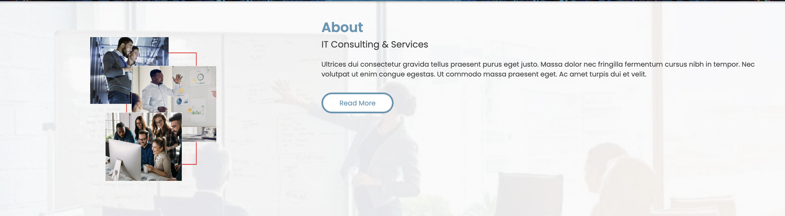
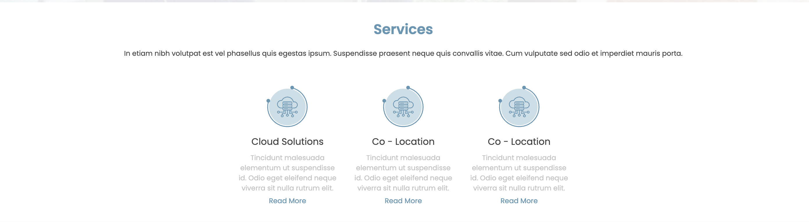
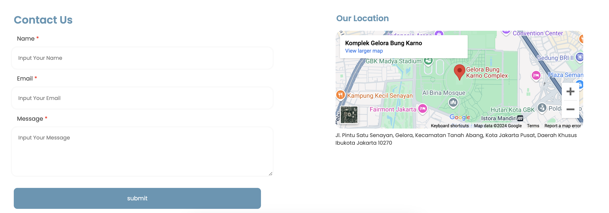

[](https://classroom.github.com/a/dyiPpHu0)

# How To Run the Project
You can click the link or copy and paste in your browser
https://kerjamulu.site/

## Why choose Netlify as a External Libraries
- With Netlify, you can easily deploy your website directly from GitHub, GitLab, or Bitbucket repositories. Each time you push changes to your repository, Netlify automatically builds and deploys your site, streamlining the workflow.
- Netlify has an intuitive web interface, making it easy to manage sites, track deploys, set up DNS, and access analytics.

## Why choose this Design Web
- The design should align with the brand’s identity, reflecting its values, style, and personality.
- A design that is intuitive and easy to navigate makes the user experience smoother.

## Development Process

### Navigation Bar & Banner

In this step, i create Navigation Bar with semantic <nav> as a wrapper. And for responsive i create hamburger button for mobile responsive. You can check the code below :

```
<nav class="navbar">
            <div class="logo"><h1>Logo</h1></div>
            <div class="txt-link">
                <ul>
                    <li style="list-style: none;"><a href="#" style="text-decoration: none;">Home</a></li>
                    <li style="list-style: none;"><a href="#" style="text-decoration: none;">About Us</a></li>
                    <li style="list-style: none;"><a href="#" style="text-decoration: none;">Services</a></li>
                    <li style="list-style: none;"><a href="#" style="text-decoration: none;">Contact Us</a></li>
                </ul>
            </div>

            <div class="iconsidebar">
                <i class="fa-solid fa-bars" 
                style="color: var(--white); margin-right: 4vh; margin-top: 2vh; "></i>
            </div>

        </nav>
```
### About Us

In This Section i use semantic <main> and <section>. When the responsive mobile, the image will hide from content.

```bash
 <section class="carousel-wrap">
                <h3>We Implements</h3>
                <h5>CORPORATE SOFTWARE</h5>        
                <p>Maecenas cursus massa luctus lectus hendrerit.
                    Dignissim fermentum hac sit pellentesque pellentesque 
                    ultrices porta tristique.</p>
                <div class="carousel">
                    <div class="carousel-bd"></div>
                </div>
            
        </section>
```

### Services

In this step i crete with flex for the content. 

``` bash
<section class="services-wrap">
            <h3 style="text-align: center; padding-top: 4vh;
            color: var(--primary); font-weight: 600;">Services</h3>
            <p style="text-align: center; color: var(--fontblack);
            font-size: 12px; padding: 2vh 4vh 0 4vh;">In etiam nibh volutpat est vel phasellus quis egestas ipsum. Suspendisse praesent 
                              neque quis convallis vitae. Cum vulputate sed odio et imperdiet mauris porta.</p>
            <div class="service-card-wrap">
                
                <div class="service-card">
                    
                    <div class="service-card-txt">
                        <h5>Cloud Solutions</h5>
                    <p>Tincidunt malesuada elementum ut 
                        suspendisse id. Odio eget eleifend 
                        neque viverra sit nulla rutrum elit.</p>
                    </div>
                    <div class="service-card-btn">
                        <a href="#">Read More</a>
                    </div>
                </div>
</section>

```

### Contact Us

In this step, i use flex for split the content.
```bash
<section class="contact-wrap">
            <div class="input-box-wrap">
                <h3>Contact Us</h3>
                <div class="input-box">
                    <h5 style="font-weight: 300; padding-left: 2vh;
                    padding-bottom: 1vh; color: var(--fontblack);">Name
                    <span style="color: red;">*</span></h5>
                    <input type="text" placeholder="Input Your Name">
                </div>
    
                <div class="input-box">
                    <h5 style="font-weight: 300; padding-left: 2vh;
                    padding-bottom: 1vh; color: var(--fontblack);">Email
                    <span style="color: red;">*</span></h5>
                    <input type="text" placeholder="Input Your Email">
                </div>

                <div class="input-box-message">
                    <h5 style="font-weight: 300; padding-left: 2vh;
                    padding-bottom: 1vh; color: var(--fontblack);">Message
                    <span style="color: red;">*</span></h5>
                    <textarea name="message" placeholder="Input Your Message"></textarea> 
                </div>

                <div class="contact-btn">
                    <input class="contact-btn-submit" type="button" value="submit">
                </div>
            </div>
        
        <div class="map-wrap">
            <h3>Our Location</h3>
            <div class="map">
                <iframe src="https://www.google.com/maps/embed?pb=!1m18!1m12!1m3!1d5791.
                82238482559!2d106.80264107133588!3d-6.217317766773743!2m3!1f0!2f0!3f0!3m2
                !1i1024!2i768!4f13.1!3m3!1m2!1s0x2e69f16b11f44677%3A0xe0b6ad924afd76f0!2s
                Gelora%20Bung%20Karno%20Complex!5e0!3m2!1sen!2sid!4v1732020561742!5m2!1sen
                !2sid" width="100%" height="100%" style="border:0;" allowfullscreen="" loading="lazy" referrerpolicy="no-referrer-when-downgrade"></iframe>
                <p>Jl. Pintu Satu Senayan, Gelora, Kecamatan Tanah Abang, Kota Jakarta Pusat, Daerah Khusus Ibukota Jakarta 10270</p>
            </div>
        </div>
        </section>
```
